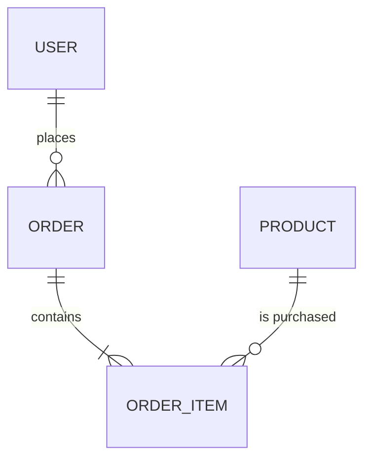

# Simple E-commerce ER Diagram and DB Schema
Scope: very simple application with Users, Products, and Orders (with Order Items).

## ER Diagram (Mermaid)


## Entities (concise)
- Users
  - id (PK), email (unique), password_hash, full_name, created_at, updated_at
- Products
  - id (PK), name, description, price_cents, currency_code, is_active, created_at, updated_at
- Orders
  - id (PK), user_id (FK to users), status, currency_code, total_cents, created_at, updated_at
- Order Items
  - id (PK), order_id (FK to orders), product_id (FK to products), product_name_snapshot, unit_price_cents, quantity, line_total_cents (generated)

Notes:
- Order Items snapshot the product name and unit price at time of purchase; product updates won’t change historical orders.
- `line_total_cents` is generated from `quantity * unit_price_cents`.
- `total_cents` on orders can be validated or recalculated at application layer.

## PostgreSQL DDL
```sql
-- Minimal, production-friendly defaults and constraints

-- citext for case-insensitive email
CREATE EXTENSION IF NOT EXISTS citext;

-- order status enum
DO $$
BEGIN
  IF NOT EXISTS (SELECT 1 FROM pg_type WHERE typname = 'order_status') THEN
    CREATE TYPE order_status AS ENUM ('pending', 'paid', 'cancelled');
  END IF;
END$$;

-- users
CREATE TABLE IF NOT EXISTS users (
  id              BIGSERIAL PRIMARY KEY,
  email           CITEXT NOT NULL UNIQUE,
  password_hash   TEXT NOT NULL,
  full_name       TEXT,
  created_at      TIMESTAMPTZ NOT NULL DEFAULT now(),
  updated_at      TIMESTAMPTZ NOT NULL DEFAULT now()
);

-- products
CREATE TABLE IF NOT EXISTS products (
  id              BIGSERIAL PRIMARY KEY,
  name            TEXT NOT NULL,
  description     TEXT,
  price_cents     INTEGER NOT NULL CHECK (price_cents >= 0),
  currency_code   CHAR(3) NOT NULL DEFAULT 'USD',
  is_active       BOOLEAN NOT NULL DEFAULT TRUE,
  created_at      TIMESTAMPTZ NOT NULL DEFAULT now(),
  updated_at      TIMESTAMPTZ NOT NULL DEFAULT now()
);

-- orders
CREATE TABLE IF NOT EXISTS orders (
  id              BIGSERIAL PRIMARY KEY,
  user_id         BIGINT NOT NULL REFERENCES users(id) ON DELETE RESTRICT,
  status          order_status NOT NULL DEFAULT 'pending',
  currency_code   CHAR(3) NOT NULL DEFAULT 'USD',
  total_cents     INTEGER NOT NULL CHECK (total_cents >= 0),
  created_at      TIMESTAMPTZ NOT NULL DEFAULT now(),
  updated_at      TIMESTAMPTZ NOT NULL DEFAULT now()
);

-- order_items
-- Snapshot of product name and price at time of purchase
CREATE TABLE IF NOT EXISTS order_items (
  id                  BIGSERIAL PRIMARY KEY,
  order_id            BIGINT NOT NULL REFERENCES orders(id) ON DELETE CASCADE,
  product_id          BIGINT NOT NULL REFERENCES products(id) ON DELETE RESTRICT,
  product_name_snapshot TEXT NOT NULL,
  unit_price_cents    INTEGER NOT NULL CHECK (unit_price_cents >= 0),
  quantity            INTEGER NOT NULL CHECK (quantity > 0),
  line_total_cents    INTEGER GENERATED ALWAYS AS (quantity * unit_price_cents) STORED
);

-- indexes
CREATE INDEX IF NOT EXISTS idx_orders_user_created ON orders(user_id, created_at DESC);
CREATE INDEX IF NOT EXISTS idx_order_items_order ON order_items(order_id);
CREATE INDEX IF NOT EXISTS idx_order_items_product ON order_items(product_id);
```

## Minimal Data Flow
- A user places an order → creates a row in `orders`.
- Each product added to the order creates an `order_items` row with a snapshot of name and price.
- `orders.total_cents` should equal the sum of item `line_total_cents` at checkout time (enforced in app/business logic for simplicity).

## Simplifications
- No inventory, variants, categories, addresses, payments, or shipments in this minimal model.
- Currency handling is simplified with a single currency_code per product/order.